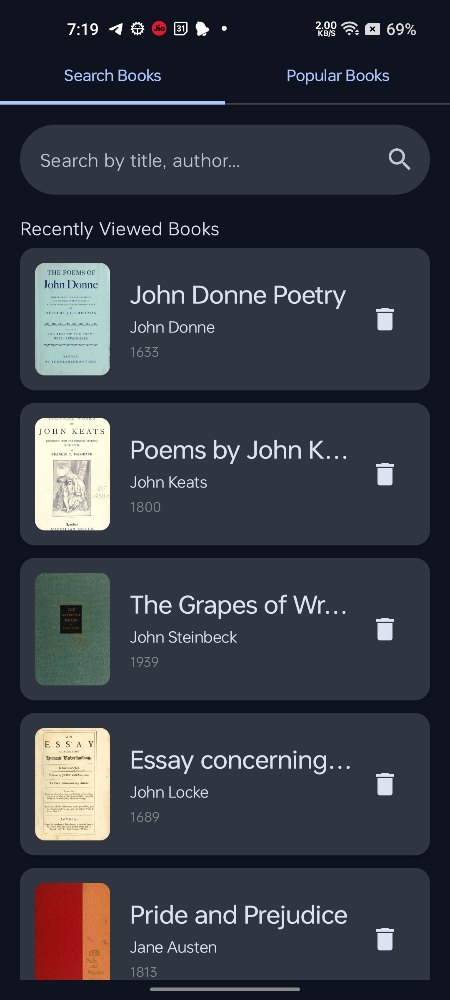
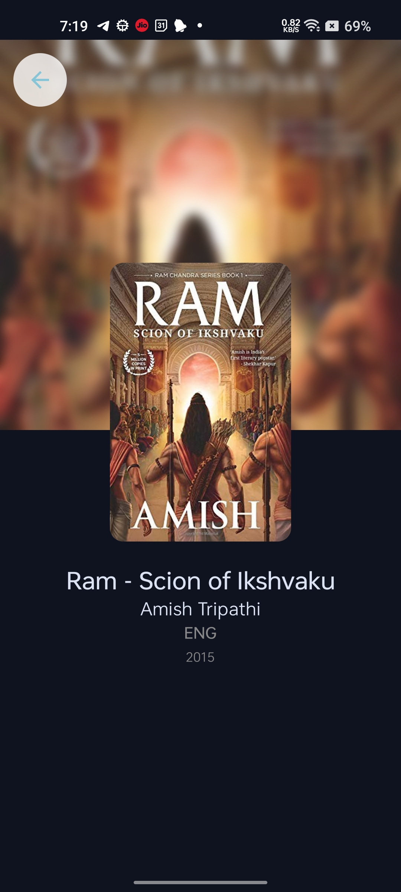
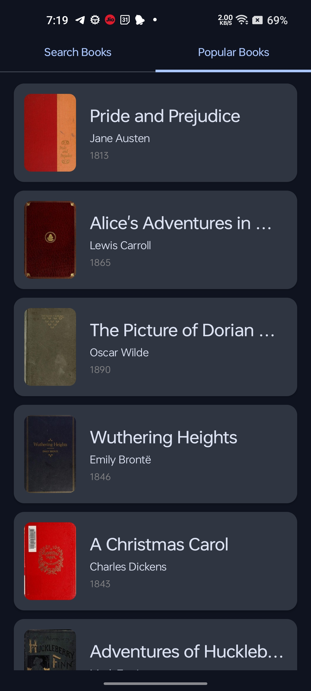

# BookFinder

BookFinder is a modern Android application built to help users discover and keep track of books. Users can search for books by title or author, view detailed information, and see a list of their recently viewed books. The app is built with a clean, scalable architecture and leverages modern Android development practices.

### Table of Contents
1. Features
2. Architecture & Technical Stack
    - Language
    - Architecture
    - Libraries Used
3. APIs Used
4. Build & Run Instructions
5. Project Structure
6. Known Issues & Future Improvements

---

### Features
- **Search Books:** Search for books from a vast collection using the Open Library API.
- **Infinite Scrolling:** Seamlessly scroll through search results with pagination.
- **Book Details:** View detailed information for each book, including author, publication year, and cover image.
- **Recent History:** The app automatically saves viewed books to a local database for quick access later.
- **Offline-First Details:** Book details are loaded from the local database first for a fast, offline-capable experience.
- **Delete History:** Users can remove books from their “Recently Viewed” list.

---

### Architecture & Technical Stack
This project follows modern Android architecture guidelines and utilizes a robust set of libraries to ensure it is scalable, maintainable, and testable.

### Language
- **Kotlin:** The entire application is written in Kotlin, the official language for Android development.

### Architecture
- **MVVM (Model-View-ViewModel):**
    - **View (UI Layer):** Jetpack Compose is used for building the UI declaratively.
    - **ViewModel:** Holds and manages UI-related data and state, surviving configuration changes.
    - **Model (Data Layer):** The Repository pattern abstracts data sources (Network and Local Database).

### Libraries Used
- **Jetpack Compose** – Declarative UI toolkit
- **Kotlin Coroutines & Flow** – Asynchronous operations & data streams
- **Hilt** – Dependency injection
- **Retrofit 2** – Networking with Open Library API
- **Room** – Local database persistence
- **Paging 3** – Paginated data loading
- **Coil** – Image loading
- **MockK** – Mocking for unit tests
- **JUnit 4** – Unit testing framework

---

### APIs Used
The application fetches all its data from the **Open Library API**.

- **Search API:**  
  `https://openlibrary.org/search.json?q={query}&page={page}`

- **Subjects API:**  
  `https://openlibrary.org/subjects/{subject}.json?offset={offset}&limit={limit}`

- **Covers API:**  
  `https://covers.openlibrary.org/b/id/{cover_id}-M.jpg`

---

### Build & Run Instructions

#### 1. Prerequisites
- Android Studio *Iguana | 2023.2.1* or later
- Android SDK targeting **API Level 34**
- Active internet connection

#### 2. Build Steps
- Clone the repository:
  ```bash
  git clone https://github.com/Tiku24/BookFinder.git

- Open the project in Android Studio

- Wait for Gradle sync to complete

- Select an emulator or connect a physical device

- Click Run 'app' (Shift + F10)

### 3. Run Tests

- Navigate to:
  app/src/test/java/com/example/bookfinder

- Right-click RepoUnitTest.kt

- Select Run 'RepoUnitTest'

---

### Project Structure
```text
com.example.bookfinder
├── data/
│   ├── local/              # Room database (DAO, entities, database class)
│   ├── model/              # Data models for API responses (e.g., SearchResponse)
│   ├── pagination/         # Paging 3 sources & paging logic for infinite scrolling
│   ├── repository/         # Repository class abstracting data sources
│   └── ApiService.kt       # Retrofit API interface
├── di/                     # Hilt dependency injection modules
├── ui/
│   ├── navigation/         # Jetpack Compose navigation graph
│   ├── screen/             # Composable screens (Search, Detail)
│   └── theme/              # App theme and styling
└── MainViewModel.kt        # Main ViewModel for the application
```
---

### Known Issues & Future Improvements
- Limited error messages for specific network failures

- No “Favorites” feature yet

- Missing fallback image for book covers

- Lacks Compose UI test coverage

- Accessibility improvements needed (content descriptions, offline badge)

### Mobile Screen Shots
 |  | 